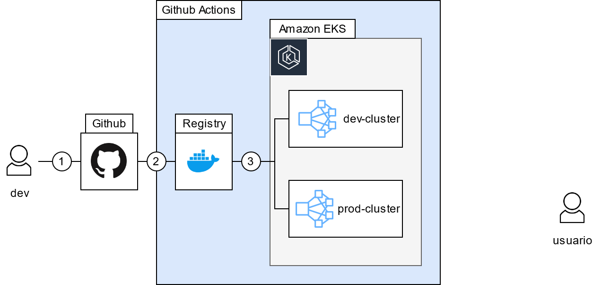
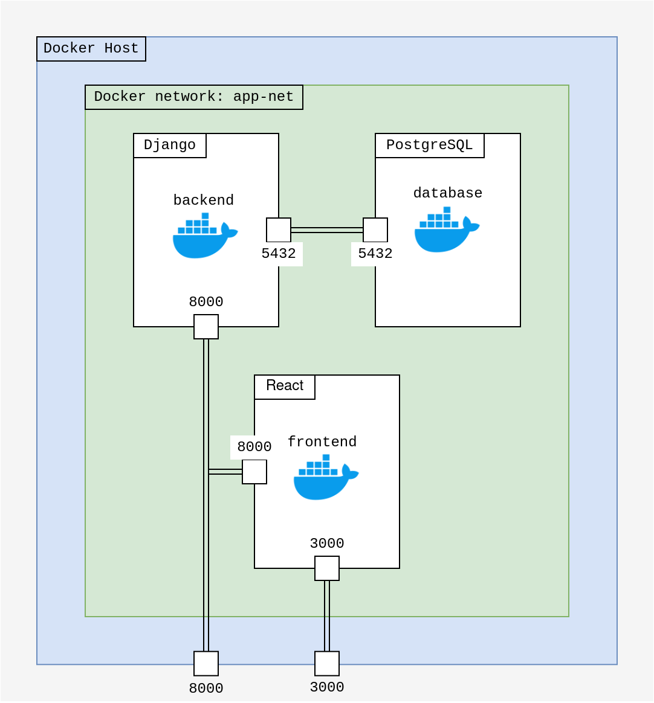
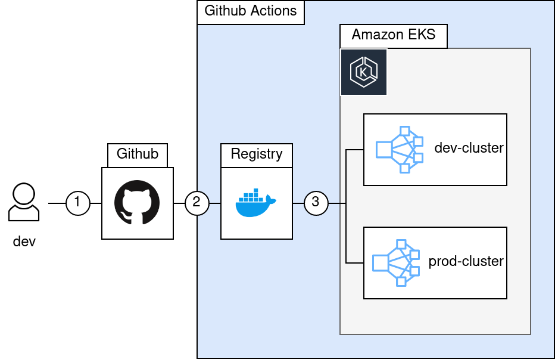

# Desafio final del curso de DevOps

Para darle un cierre a las clases de Craftech, los invitamos a intentar completar estas pequeñas tareas que resumen lo visto en el curso!

### Resumen

Se cuenta con el diseño de una aplicación para prestamos por internet. El backend fue construido con [Django](https://www.djangoproject.com/) utilizando [Python v3.7](https://www.python.org/), la cual se encuentra [acá](backend/) y el frontend fue construido con [React.js](https://es.reactjs.org/), la cual se encuentra [acá](frontend/).

Se necesita:

1. Armar un diagrama de los componentes que se involucran (Base de datos, deployments, etc) como si estuviera deployado en AWS;

	Para despliegue en EKS, se propone la siguiente topología:

	<p align="center">
	
	</p>

	Utilizar un *load balancer* de aplicación que redirigirá a los usuarios a las distintas instancias de la aplicación que corren en el servidor (*Elastic Virtual Server*, M4).
	La base de datos consumida es una Relacional PostgreSQL.

2. Dockerizar las aplicaciones Frontend y Backend;

	Se creó un *Dockerfile* para cada componente. Para construir la imagen deseada se deben ingresar los siguientes comandos:

	```bash
	$ cd <directorio>
	$ docker build -t <app-name>:<tag> .
	```
	donde: `<directorio>` es 'backend' o 'frontend', `<app-name>` es el nombre que se le desee dar a la aplicación y `<tag>` la versión de la misma.

3. Armar un docker-compose que nos permita levantar la aplicación entera y sus dependencias;

	<p align="center">
	
	</p>

	En la imagen superior se muestra los servicios creados por *docker compose*:

	- *Backend*;
	- *Base de datos*: [PostgreSQL](https://www.postgresql.org/);
	- *Frontend*.

	Para lanzar los servicios se debe ingresar la siguiente linea (en caso de querer re-construir las imágenes utilizar la opción `--build`:

	```bash
	$ docker-compose up
	```

4. Armar los manifiestos de Kubernetes para deployar las aplicaciones y sus dependencias en un cluster (Utilizar minikube como ref);

	Para generar los manifiestos de Kubernetes se utilizó *kompose*. El comando a ejecutar es:

	```bash
	$ kompose convert -o ./<directorio>
	```
	donde `<directorio>` es el lugar en el que se guardarán los manifiestos generados.

	Para poder conectar la base de datos con el *backend* se creó manualmente un servicio que expone la base de datos ([**k8s-files**](https://github.com/tomasspi/curso-basico-devops-marzo-2021/tree/development/5-desafio/k8s-files) en este caso).

5. Diseñar un pipeline de CI/CD de la aplicación frontend y backend que nos permita deployar en 2 entornos (dev y prod).

	<p align="center">
	
	</p>

	En la imagen superior se muestra el *pipeline* CI/CD propuesto.

	1. Se realiza un *push* al repositorio;
	2. Se ejecuta un trabajo de *Github Actions* que publica la nueva imagen de la aplicación al Registro de Docker.
	3. Realiza el *Deployment* en *AWS EKS* al clúster correspondiente:
		- Si el *push* se realiza en la rama *development* la aplicación se despliega en *dev-cluster*.
		- Si el *push* se realiza en la rama *main* la aplicación se despliega en *prod-cluster*.
